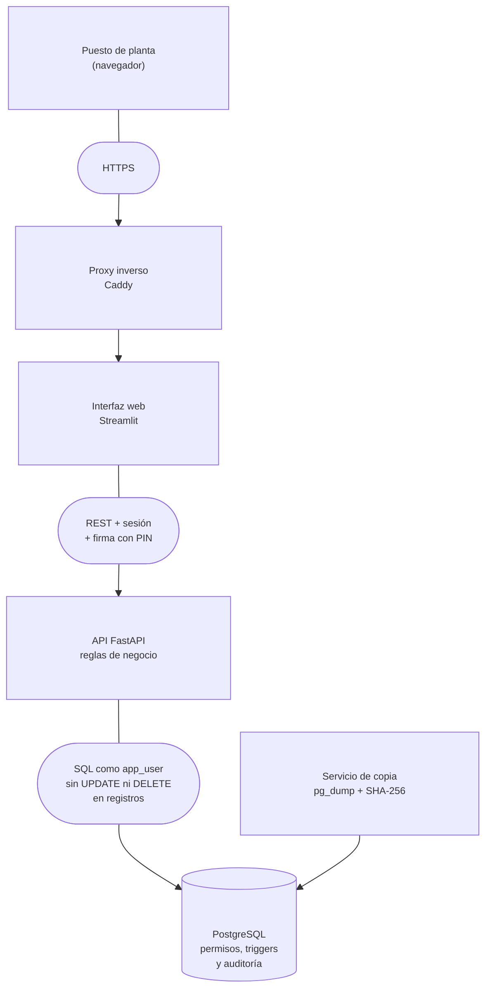

# Libro Diligenciado Digital

**Registro electrónico GMP de existencias, movimientos y transformaciones de producto por lote y ubicación, para planta químico-farmacéutica.**

Sustituye al libro diligenciado en papel: cada entrada, salida, traslado y transformación queda registrada, firmada por los operarios que la realizan y protegida frente a cualquier modificación posterior, incluso por parte del administrador de la base de datos.

> **Proyecto comercial: el código fuente es privado.** Este repositorio describe el sistema, su arquitectura y las decisiones técnicas. Demo en vivo o revisión del código bajo petición ([contacto](#contacto)).

<!-- 👉 VÍDEO: GitHub no incrusta vídeos de YouTube/Loom. Usa una captura como miniatura enlazada:
     1. Guarda una captura del vídeo en docs/img/video-miniatura.png
     2. Sustituye ENLACE_AL_VIDEO y descomenta la línea siguiente -->
<!-- [](ENLACE_AL_VIDEO) -->

**▶ [Vídeo: el sistema funcionando en 90 segundos](ENLACE_AL_VIDEO)** <!-- 👉 cambia ENLACE_AL_VIDEO -->

---

## El problema

El libro en papel es el registro oficial de lo que entra, sale y se transforma en planta, pero no impide los errores ni protege lo escrito:

| En el libro en papel o en Excel… | En el Libro Diligenciado Digital… |
|---|---|
| Se puede tachar, sobrescribir o borrar una línea. | Ningún registro se modifica ni se borra: lo impide la propia base de datos. Una corrección es un registro nuevo enlazado al original. |
| Nada impide sacar más cantidad de la que hay. | El stock se calcula en tiempo real y nunca puede quedar en negativo. |
| Un mismo producto aparece con nombres distintos. | Los productos se dan de alta con nombres de un catálogo cerrado. |
| No siempre consta de quién se recibió o a quién se entregó. | Toda entrada indica su proveedor o cliente y toda salida, su destinatario. |
| La firma es una rúbrica difícil de atribuir. | Cada operario entra con su usuario y firma con su PIN; dos operarios por operación, uno realiza y otro verifica. |
| Reconstruir la vida de un lote exige revisar libros a mano. | La historia de un lote, su origen y su destino se consultan y exportan en segundos. |

## Así se ve

<!-- 👉 CAPTURAS: guárdalas en docs/img/ con estos nombres y descomenta cada línea.
     Consejo: ventana a 1280 px de ancho, datos de demostración, sin datos reales de ninguna empresa. -->

<!--  -->
<!--  -->
<!--  -->
<!--  -->
<!--  -->

Un asiento del libro, tal como lo muestra el sistema:

```
MOV-12 · 03/10/2026 10:30 · Traslado
Lote    Flor THC · MP-26-0001 · 25 kg
Ruta    Almacén 2 → Almacén 1
Firmas  Ana García (realiza) · Luis Pérez (verifica)
```

## Qué hace

- **Movimientos** con origen y destino: entradas desde proveedor o cliente, salidas hacia cliente o proveedor y traslados internos entre ubicaciones.
- **Transformaciones:** uno o varios lotes se consumen para generar lotes nuevos (materia prima → intermedio + residuo).
- **Correcciones sin borrar:** un movimiento erróneo se anula con otro inverso enlazado; una línea de transformación, con una anulación y una corrección. Si el lote ya se ha consumido aguas abajo, el sistema bloquea la corrección y exige una anotación.
- **Datos maestros** con baja lógica y auditoría campo a campo: productos, ubicaciones, proveedores y clientes, operarios y catálogo de nombres.
- **Stock en tiempo real** por lote y ubicación.
- **Histórico y auditoría:** libro completo, historia de cada lote con su saldo, trazabilidad hacia atrás y hacia delante, cadenas de corrección, registro de accesos y exportación a Excel.
- **Migración del libro en papel** desde Excel, con las mismas validaciones que una operación nueva: detecta los errores del papel e indica la fila exacta.

## Arquitectura



- Toda regla de negocio vive en la capa de servicios de la API. La interfaz nunca accede a la base de datos y los endpoints no contienen lógica.
- La base de datos es la última barrera: repite las reglas críticas como restricciones, permisos y triggers, aunque la aplicación fallara.

## Decisiones técnicas

**Inmutabilidad en el motor, no en el código.** La aplicación se conecta con un rol que solo puede leer e insertar en las tablas de registros. Además, unos triggers rechazan cualquier `UPDATE`, `DELETE` o `TRUNCATE` sobre ellas, también al propietario del esquema:

```
UPDATE movimiento SET cantidad = 1;
ERROR:  permission denied for table movimiento                         -- como app_user
ERROR:  Registro GMP inalterable: UPDATE sobre movimiento no permitido -- como propietario
```

**Correcciones encadenadas, nunca dobles.** Un registro solo puede anularse una vez; si la corrección también era errónea, se corrige la corrección. Lo garantiza un índice único parcial en la base de datos, aunque dos operarios pulsen en el mismo instante.

**Concurrencia sin stock negativo ni interbloqueos.** Cada operación bloquea las filas de stock que va a tocar, siempre en el mismo orden (producto, ubicación). Las bajas de datos maestros usan un bloqueo exclusivo frente al compartido de las operaciones, de modo que nunca queda un maestro dado de baja con stock. La edición concurrente de maestros usa control optimista: el segundo cambio se rechaza en lugar de pisar al primero.

**Firma con significado.** Cada operario firma con un PIN que solo él conoce (hash scrypt con sal, bloqueo tras cinco intentos fallidos). Se guarda quién *realiza* y quién *verifica*, y los accesos y firmas fallidas quedan en un registro que tampoco se puede modificar.

**Auditoría independiente de la aplicación.** Un trigger `SECURITY DEFINER` registra cualquier cambio en datos maestros y stock, venga de la aplicación o de SQL directo, con el usuario de base de datos que lo hizo. La aplicación puede leer esa auditoría, pero no escribir en ella.

**Despliegue reproducible.** Imágenes base fijadas por *digest*, dependencias instaladas desde un fichero bloqueado con verificación de *hash*, contenedores sin root, HTTPS como único punto de entrada y copias de seguridad con huella SHA-256 y restauración probada.

## Calidad y validación

- **100 pruebas automatizadas** (pytest) contra PostgreSQL real, incluidas pruebas sobre el esquema tal como lo despliegan las migraciones: permisos, triggers y auditoría.
- **Pruebas de concurrencia:** 9 escenarios con decenas de peticiones simultáneas sobre los mismos registros.
- **Documentación de validación** conforme a GAMP 5 (Categoría 5) y EU GMP Anexo 11:
  - especificación de requisitos y análisis de riesgos de integridad de datos;
  - especificaciones funcional y técnica;
  - plan de validación, protocolos IQ, OQ y PQ con matriz de trazabilidad requisito → prueba;
  - borradores de procedimientos operativos.
- **ALCOA+:** atribuible, legible, contemporáneo, original, exacto, completo, consistente, perdurable y disponible, cada principio cubierto por un mecanismo concreto del sistema.

## Stack

| Capa | Tecnología |
|---|---|
| Backend | Python · FastAPI · Pydantic · SQLAlchemy 2.0 |
| Base de datos | PostgreSQL 16 · Alembic (esquema, permisos y triggers versionados) |
| Interfaz | Streamlit |
| Datos | Pandas · openpyxl (importación y exportación Excel) |
| Despliegue | Docker Compose · Caddy (HTTPS) |
| Pruebas | pytest |

## Código fuente

El código es privado porque se trata de un proyecto comercial. Si quieres ver el sistema funcionando o revisar el código, escríbeme y organizamos una demo o un acceso temporal.

## Contacto

<!-- 👉 Cambia los enlaces y el email -->
**Alessandro** · Backend Developer → Data Engineer

[LinkedIn](https://www.linkedin.com/in/alessandrogm) · [Web](https://aless-mereu.github.io/Landing-page-personal/) · [alessandrog.mereu@gmail.com](mailto:alessandrog.mereu@gmail.com?subject=Libro%20Diligenciado%20Digital)

---

© 2026 Alessandro García Mereu. Todos los derechos reservados. Este repositorio no concede ninguna licencia sobre el software descrito.
